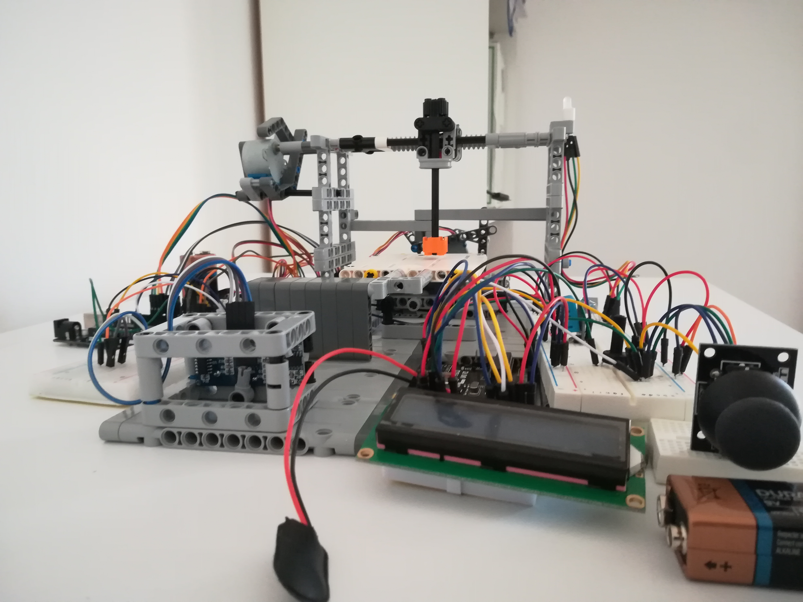
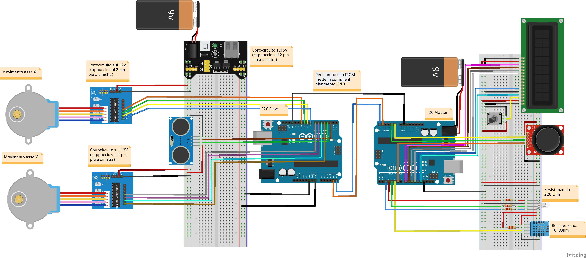

# Lego 2 Axis Machine
## Moving a 2 axis machine with Arduino and I2C

Video can be found [here](https://www.youtube.com/watch?v=OcLfV5zg7JQ)

### 1. Scheme
This is the circuit scheme

### 2. Libraries
In this project I used these libraries
- **BdStepper** for stepper motor driving (writed by my own and available [here](https://github.com/andreaBidinost/projects/tree/master/Arduino/Stepper%20motor%20288BYJ-48))
- **LiquidCrystal** for display writing
- **DHT** for temperature sensor
- **Wire** for I2C communication

### 3. I2C
This protocol manage the communication between two devices (eg. two Arduino Uno R3).
Devices communicate through SDL/SDA wires (eg. pin A5/A4).
As suggested, I linked the ground signal for both of boards.
Learn more about I2C [here](https://www.arduino.cc/en/Tutorial/MasterReader).

### 4. Lego Structure
I used Lego bricks for the infrastucture building.
Stepper motors are directly linked to machine axis (Lego sticks).
I followed [this tutorial](https://www.youtube.com/watch?v=MFkKXEf306Q&t=7s) to understand how to build a worm gear nut.
Terminal tip (pen, laser, drill bit) is simulated by a lego stick.

### 5. How it works
1. Wait for the "Zero Machine" phase that put the terminal tip at (0, 0) position
2. Setup the destination coordinates between the range [0;5]x[0;5] (cm)
3. Wait for the tip positioning and go back to previous point

### 6. Miscellaneous infromations
During the machine lifetime a led indicate the machine state. 
To bring the tip at origin I used a distance sensor for y-axis and nothing but "a lot of motor rotation" for x-axis.
A complete rotation of a motor move the axis for about 1.5 cm.

### 7. Future improving
- Motors depend a lot on battery charge. I have to change the alimentation method
- I have to improve the zero-ing for the x-axis (with another distance sensor or an end-ride sensor)
