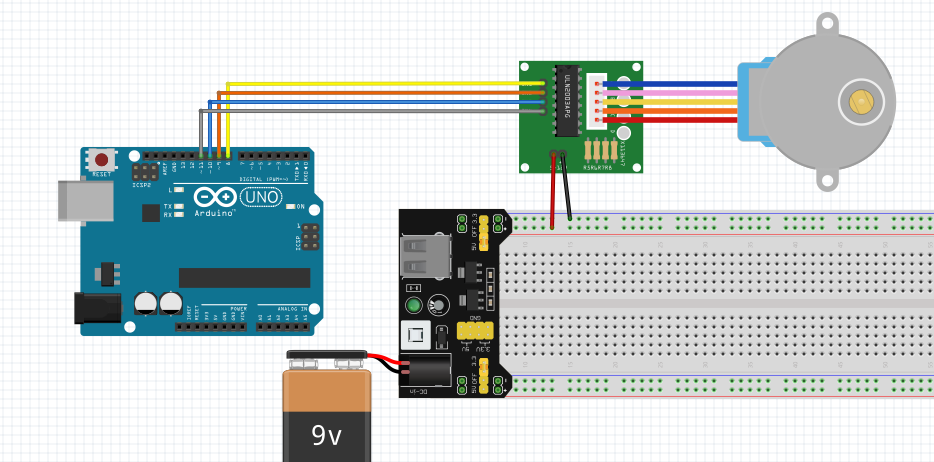

# Libreria BdStepper
## Rotazione di un motore passo passo di tipo 288BYJ-48

### 1. Schema
Per il circuito ho seguito questo schema, uitlizzando il driver ULN2003

### 2. Modalità di rotazione
I motori passo passo possono essere mossi in 3 modalità:
- half step (mezzo passo)
- full step - 1 phase (passo pieno a una fase)
- full step - 2 phase (passo pieno a due fasi)

Per una descrizione completa di queste modalità si veda 