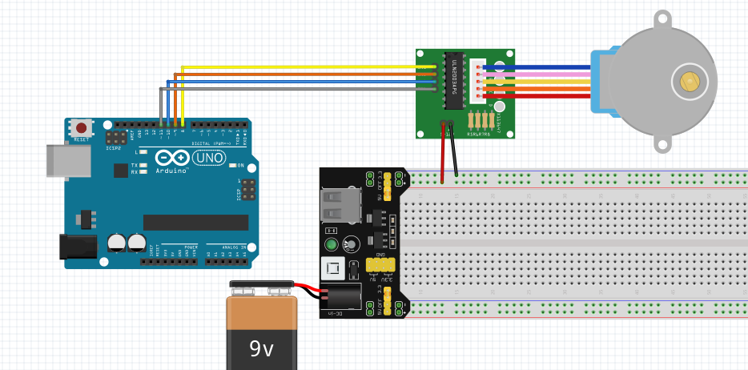

# Libreria BdStepper
## Rotazione di un motore passo passo di tipo 28BYJ-48

### 1. Schema
Per il circuito ho seguito questo schema, uitlizzando il driver ULN2003

### 2. Modalità di impostazione delle bobine
I motori passo passo possono essere mossi in 3 modalità:
- **half step** (mezzo passo)
- **full step - 1 phase** (passo pieno a una fase)
- **full step - 2 phase** (passo pieno a due fasi)

Per una descrizione completa di queste modalità si veda [questo sito](https://www.rs-online.com/designspark/stepper-motors-and-drives-what-is-full-step-half-step-and-microstepping)

### 3. Modalità di rotazione:
Il motore può essere mosso in **SENSO_ORARIO** o in **SENSO_ANTI_ORARIO**.
E' possibile specificare il numero di gradi della rotazione attraverso la funzione **ruotaPerGradi**.
E' possibile specificare la quantità di tempo (in millisecondi) della rotazione attraverso la funzione **ruotaPerMillisecondi**.

### 4. Limiti del motore
Attraverso prove ripetute ho calcolato alcuni limiti riguardanti il motore 288BYJ-48 pilotato con driver ULN2003:
- rotazione minima raggiungibile: **5 gradi**
- limiti di velocità superiori: **1.496 rad/s, 85.71 grad/s, 14.28 giri/min**

### 5. Mal funzionamento
Ho notato un mal funzionamento del motore (rumori interni ma nessun movimento) e del driver (led sempre attivi, intensità luminosa molto lieve, led attivi ma motore fermo) in questi casi:
- la batteria collegata al driver non fornisce più voltaggio massimo (da 9 a 7 Volt): per risolvere questo problema ho alimentato il driver direttamente da Arduino ma meglio comprare una batteria nuova
- i led dei segnali inviati al motore rimangono sempre accesi ma il motore non si muove: controllare la carica della batteria, assicurarsi di non aver superato le velocità limite del punto precedente, premere con forza la morsettiera bianca dei cavi del motore
- i led si accendono con luce fioca: è sicuramente colpa della batteria o il driver è alimentato con meno di 5 volt
